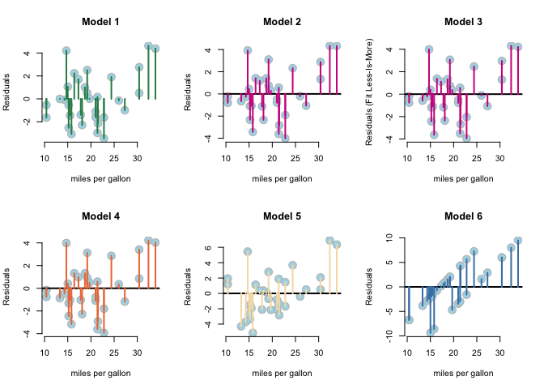

# Transmission impact on Motor mpg - a regression approach
Georgia P  
2014  
========================================================

##Executive summary

###Questions
1. "Is an automatic or manual transmission better for MPG”
2. "Quantify the MPG difference between automatic and manual transmissions"

**Manual transmission** appears to give **better mpg efficiency** in cars tested by minimum  
**~15** mpg and maximum  **~20** mpg versus automatic transmission.

##Methodology
1. Explored datasets, to understand variables correlations and approach
2. Fitted mutliple models, compared their diagnostics and picked models shortlist
3. Compared best model fit.
4. Calculated difference of estimated MPG for the two cases (manual, automatic).


##Analysis

By checking the details of the mtcars dataset, the variable that defines the transmission is "am", a dummyvariable, with values : am   Transmission (0 = automatic, 1 = manual), that for convenience, I will rename to "auto" & "manual" respectively.


###Data Exploration

First, I will explore correlations in this set to discover which ones are the relatively **significant variables** to include in the model and which aren't.

```r
pairs(mtc, panel = panel.smooth, main = "MT Cars", col = 13 + (mtc$am >0))
```

 
I observe that indeed a few variables are correlated with each other and with mpg, presenting a monotonous distribution.
Also by coloring the two transmission types, I notice that they are distinct.

####Principal Components Analysis
Then, I will quantify these correlations of variables to exclude those that are highly correlated with each other

```r
 M<-abs(cor(mtc))
 wM <- which(M> 0.9, arr.ind=T)
```
    
Variables disp and cyl present **correlation >0.9** so we could use only one of them as a predictor. If I want to select a few more that appear to highly correlated, I lower my threshold to 0.8 :


```r
wM2 <-which(M> 0.8, arr.ind=T)
```
I notice that the following variables are the most correlated with the outcome (mpg) : 
1.wt
2.cyl
3.disp
4.hp 

So if I keep those with best mpg correlation I select : **wt** (and exclude disp) & **cyl** (and exclude hp, vs, disp).
So finally I conclude to the following variables as my principle components :
wt, cyl, am, gear, drat, qsec, card

###Model Fit for Manual Transmission

Let's check what fitting with the above insights yields to. 
First I convert my dummy variable in a character set, to make my results more easily interpretable.

```r
mtc$am<-as.character(mtc$am)
mtc$am[mtc$am=="0"]<-"auto"
mtc$am[mtc$am=="1"]<-"manual"
```

Then I fit various models, one generic with all variables and a few more down the road incorporating the selections of principal variables I have done before.


```r
  fit1<-lm(formula = mpg ~ .,  data = mtc) 
  f1<-summary(fit1)
  fit2<-lm(formula = mpg ~ wt + cyl + am + gear + drat + qsec + carb,  data = mtc)
  f2<-summary(fit2)
  fit3<-lm(formula = mpg ~ wt  + am + gear + drat + qsec + carb,  data = mtc)
  f3<-summary(fit3)
  fit4<-lm(formula = mpg ~ wt  + am  + drat + qsec + carb,  data = mtc)
  f4<-summary(fit4)
  fit5<-lm(formula = mpg ~ wt  + am  + drat ,  data = mtc)
  f5<-summary(fit5)
  fit6<-lm(formula = mpg ~ am ,  data = mtc)
  f6<-summary(fit6)
```

For the above models I check diagnostics with anova

```r
anova(fit1,fit2,fit3, fit4, fit5, fit6)
```

```
## Analysis of Variance Table
## 
## Model 1: mpg ~ cyl + disp + hp + drat + wt + qsec + vs + am + gear + carb
## Model 2: mpg ~ wt + cyl + am + gear + drat + qsec + carb
## Model 3: mpg ~ wt + am + gear + drat + qsec + carb
## Model 4: mpg ~ wt + am + drat + qsec + carb
## Model 5: mpg ~ wt + am + drat
## Model 6: mpg ~ am
##   Res.Df    RSS Df Sum of Sq       F    Pr(>F)    
## 1     21 147.49                                   
## 2     24 154.92 -3     -7.43  0.3526   0.78769    
## 3     25 155.13 -1     -0.21  0.0295   0.86535    
## 4     26 156.75 -1     -1.62  0.2307   0.63594    
## 5     28 266.99 -2   -110.24  7.8476   0.00285 ** 
## 6     30 720.90 -2   -453.91 32.3134 3.899e-07 ***
## ---
## Signif. codes:  0 '***' 0.001 '**' 0.01 '*' 0.05 '.' 0.1 ' ' 1
```

It appears that **Model 6 (where transimission type is the only variable) is top performing**.
To confirm I will check the Standard Error and T-statistics / Type I error probability as by summarizing model statistics :   

```
## [1] "Model 1 : "
```

```
##   Estimate Std. Error    t value   Pr(>|t|) 
## 12.3033742 18.7178844  0.6573058  0.5181244
```

```
## [1] "Model 2 : "
```

```
##   Estimate Std. Error    t value   Pr(>|t|) 
## 11.5556851 17.8224719  0.6483772  0.5228967
```

```
## [1] "Model 3 : "
```

```
##   Estimate Std. Error    t value   Pr(>|t|) 
##  8.7850865  8.6705699  1.0132075  0.3206673
```

```
## [1] "Model 4 : "
```

```
##   Estimate Std. Error    t value   Pr(>|t|) 
##  9.9242985  8.2592008  1.2016052  0.2403478
```

```
## [1] "Model 5 : "
```

```
##     Estimate   Std. Error      t value     Pr(>|t|) 
## 2.989696e+01 7.460191e+00 4.007532e+00 4.118044e-04
```

```
## [1] "Model 6 : "
```

```
##     Estimate   Std. Error      t value     Pr(>|t|) 
## 1.714737e+01 1.124603e+00 1.524749e+01 1.133983e-15
```

Again, Model 6 presents very small probability of Type I error = 0 and the lowest standard error  = 1.12 

**Residuals Variation for each model** :   

-Model 1 : 2.65    
-Model 2 : 2.541   
-Model 3 : 2.491   
-Model 4 : 2.455   
-Model 5 : 3.088    
-Model 6 : 4.902 

I observe that indeed the model ** where Transmission type is the only predictor (regressors)** is the one with strongest coefficients, and smaller standard error, as well as an maximum residual variation explained by the model.

This can be visualized by plotting residuals for every model.

 


###MPG impact of Manual Transmission
####How much better is the manual transmission for mpg? 


```r
#get coefficients
sumCoef<-summary(fit6)$coefficients 
#calculate confidence intervals
coefficients <- sumCoef[1,1]+c(-1,1)*qt(.975,df=fit5$df)*sumCoef[1,2]
```

By the model parameters, manual transmission **increases the efficiency of miles per gallon by 17.15  (with a standard error of 1.12 )**. 

With 95% confidence the confidence interval of the increase move in the zone from **14.84** to  **19.45**.

So, it appears that the **existence of the manual transmission, indeed improves mpg efficiency**.

